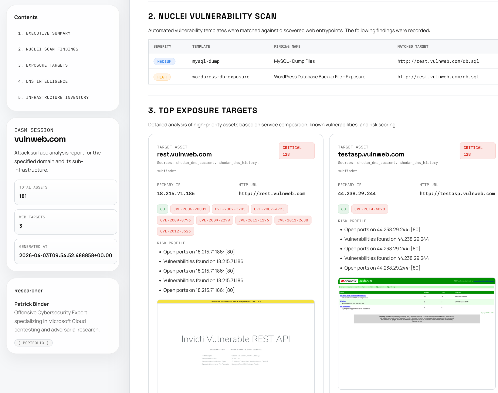

<div align="center">

# C3PO-shodan EASM Agent
---
[](https://www.python.org/downloads/)
[](https://www.gnu.org/software/bash/)
[](https://www.shodan.io/)
[](https://github.com/projectdiscovery/nuclei)
[](https://github.com/google-gemini/gemini-cli)
# Agentic super external attack surface scanner
**A local Shodan and Nuclei attack-surface workflow intended to be driven from Gemini CLI.**
</div>

<div align="center">
  
</div>
## Overview

`C3PO-shodan` maps a domain's exposed infrastructure with Shodan DNS and host telemetry, enriches the most relevant web targets with Nuclei, and renders the result into Markdown and HTML artifacts for operator review.

The pipeline is deterministic. Gemini is for operator workflow and orchestration around the repo, not for generating a separate executive-summary artifact.

## Workflow

- Shodan DNS discovery and host enrichment
- TXT and takeover-oriented DNS signal collection
- Nuclei execution against the top reachable web targets
- Optional screenshot capture for reachable HTTP/S targets
- Markdown and HTML report generation

## Prepare

### 1. System dependencies

Install these first:

- `python3` 3.10 or newer
- `bash`
- `curl`
- `nuclei`
- `gemini` CLI
- One screenshot tool if you want captures (fallback): `chromium`, `google-chrome`, `microsoft-edge`, or `wkhtmltoimage`
- **Optional (Recommended):** Cloudflare API credentials for high-fidelity screenshots and URL scanning.

Recommended Nuclei install:

```bash
go install -v github.com/projectdiscovery/nuclei/v3/cmd/nuclei@latest
```

Recommended Gemini CLI install:

```bash
npm install -g @google/gemini-cli
```

### 2. Python requirements

The Python code uses only the standard library. A minimal `requirements.txt` is included for automation compatibility.

If your environment expects the step anyway:

```bash
python3 -m pip install -r requirements.txt
```

### 3. Configure API Credentials

Set your API keys with either environment variables or a local `.env` file because `scripts/common.sh` loads it automatically.

#### Shodan

```bash
printf 'SHODANAPI=%s\n' "your_shodan_api_key" >> .env
```

Alternatively, use a local key file:

```bash
mkdir -p ~/.shodan
printf '%s\n' "your_shodan_api_key" > ~/.shodan/api_key
chmod 600 ~/.shodan/api_key
```

#### Cloudflare (Optional but recommended - better screenshots)

To enable the Cloudflare URL Scanner as the primary source for screenshots and security intelligence, add your credentials to the `.env` file.

Preferred auth is an API token created at `https://dash.cloudflare.com/profile/api-tokens` with:

- `Account` -> `Cloudflare Radar:Read`
- `Account` -> `URL Scanner:Read`
- `Account` -> `URL Scanner:Edit`

Then set:

```bash
CF_ACCOUNT_ID="your_account_id"
CF_API_TOKEN="your_api_token"
```

Legacy global API key auth is also supported if you already use it:

```bash
CF_ACCOUNT_ID="your_account_id"
CF_EMAIL="your_cloudflare_email"
CF_API_KEY="your_global_api_key"
```

Export whichever pair you use:

```bash
for rc in "$HOME/.bashrc" "$HOME/.zshrc" "$HOME/.bash_profile" "$HOME/.zprofile"; do
  [ -f "$rc" ] || continue

  grep -q "^export CF_ACCOUNT_ID=" "$rc" || printf '\nexport CF_ACCOUNT_ID="%s"\n' "$CF_ACCOUNT_ID" >> "$rc"
  if [ -n "${CF_API_TOKEN:-}" ]; then
    grep -q "^export CF_API_TOKEN=" "$rc" || printf 'export CF_API_TOKEN="%s"\n' "$CF_API_TOKEN" >> "$rc"
  fi
  if [ -n "${CF_API_KEY:-}" ] && [ -n "${CF_EMAIL:-}" ]; then
    grep -q "^export CF_API_KEY=" "$rc" || printf 'export CF_API_KEY="%s"\n' "$CF_API_KEY" >> "$rc"
    grep -q "^export CF_EMAIL=" "$rc" || printf 'export CF_EMAIL="%s"\n' "$CF_EMAIL" >> "$rc"
  fi
done

export CF_ACCOUNT_ID="$CF_ACCOUNT_ID"
export CF_API_TOKEN="${CF_API_TOKEN:-}"
export CF_API_KEY="${CF_API_KEY:-}"
export CF_EMAIL="${CF_EMAIL:-}"
```


If these credentials are missing, the pipeline will automatically fall back to local screenshot tools (Chromium, wkhtmltoimage, etc.).

### 4. Authenticate Gemini CLI

Authenticate once before using the repo through Gemini:

```bash
gemini
```

Complete the browser login flow, then return to the terminal.

### 5. Refresh Nuclei templates

```bash
nuclei -update-templates
```

### 6. Clone and preflight

```bash
git clone <your-repo-url>
cd c3po-shodan
chmod +x run.sh bin/run.sh scripts/*.sh install.sh
./install.sh
```

`install.sh` performs preflight checks for Python, Shodan, Nuclei, and Gemini.

## Run

Direct shell usage:

```bash
./run.sh example.com
```

Recommended Gemini-driven workflow from the repository root:

```text
Run ./run.sh against example.com, then help me inspect the HTML report and the Nuclei findings.
```

Primary outputs:

- `output/attack_surface_<target>_<date>.json`
- `output/attack_surface_<target>_<date>.html`
- `runtime/reports/attack_surface_<target>_<date>.md`
- `output/nuclei_<target>_<date>.jsonl`

## Notes

- Screenshot capture is optional and skipped automatically if no supported browser/image tool is installed.
- The pipeline no longer creates a separate CISO summary text artifact.
- If `nuclei` is missing, the rest of the Shodan collection and report pipeline can still complete, but vulnerability enrichment will be absent.

## Example Report

The generated reports provide a comprehensive, interactive view of the discovered attack surface. 

</div>

<div align="center">
  
</div>
